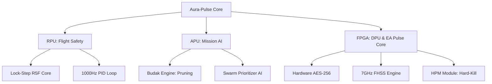

# 🚀 AURA-PULSE: Kinetic Intelligence & Tactical Electronic Attack Framework


> **"Faciendo nomen ponis."** (Yaparsan adını koyarsın.)
> 
> **Aura-Pulse**, gökyüzünde mutlak elektronik hakimiyet kurmak için tasarlanmış bir platformdur. Sadece vurucu bir drone değil, menzilindeki her türlü elektronik sistemi (drone sürüleri, yer istasyonları, sensörler) saniyeler içinde saf dışı bırakan bir **"Uçan Elektronik Harp Bataryası"**'dır.

---

## 🏗️ 1. Mimari Mükemmeliyet (System Architecture)

Aura-Pulse, **Silicon-First** yaklaşımıyla FPGA üzerinde donanımsal hızlandırılmış AI ve ultra-güvenlikli haberleşme protokollerini birleştirir.



---

## ⚡ 2. Elektronik Harp & HPM Doktrini

Aura-Pulse, menzilindeki tehditleri "temizlemek" için gelişmiş **High-Power Microwave (HPM)** protokollarını kullanır:
- **Hard-Kill (AOD):** 150 metre yarıçapındaki tüm elektronik devreleri EMP ile kalıcı olarak yakar.
- **Swarm Prioritizer:** Sürü saldırılarında merkezi noktayı (Centroid) hesaplayarak tek atışla maksimum imha sağlar.
- **EMI Hardening:** Kendi HPM darbesinden korunmak için özel Faraday kafesi mimarisine sahiptir.

---

## 🧠 3. "Budak" Optimizasyon Doktrini

- **HAAP (Hardware-Aware Adaptive Pruning):** FPGA systolic array yapısına uygun blok bazlı budama.
- **QAT (Quantization Aware Training):** INT8 hassasiyetinde, sıfır gecikme ile yüksek doğruluklu hedefleme.
- **Passive Vision-Only Tracking:** Elektronik harp (Jamming) altında GPS bağımsız navigasyon.

---

## 📊 4. Global Rakip Analizi (Tactical Benchmark)

| Platform | Ülke | Mimari | Yetenek | **Aura-Pulse Üstünlüğü** |
| :--- | :--- | :--- | :--- | :--- |
| **Anduril Roadrunner** | 🇺🇸 | Jet-VTOL | Kinetik | **HPM Directed Energy** |
| **Raytheon Coyote** | 🇺🇸 | Launchable | Multi-role | **Adaptive GaN Solid-State** |
| **Aura-Pulse** | 🇹🇷 | **Hybrid MPSoC** | **Area Neutralization** | **Hardened Lock-Step Architecture** |

---

## 📂 5. Repo Hiyerarşisi

```bash
📦 hardware/          # RF tasarımları ve BOM listeleri
📦 firmware/
  ┣ 📂 flight-core/    # RPU Lock-Step autopilot (C++)
  ┗ 📂 os-layer/       # Yocto/meta-aura layer
📦 ai_guidance/
  ┣ 📂 detector/       # Seeker & Swarm Prioritizer
  ┗ 📂 optimizer/      # Budak Engine: Pruning & Quantization
📦 protocols/
  ┣ 📂 electronic_attack/ # HPM Pulse Core (Hard-Kill)
  ┗ 📂 cryptology/     # Hardware AES-256 & FHSS
📦 gcs/               # Cyber-Military Web HUD (HPM Dashboard)
📦 simulation/        # Digital Twin & Tactical Logs
📦 DOCS/              # Technical Specs & EA Protocols
```

---

## 🚀 6. Hızlı Başlangıç (Developer Guide)

### Ortam Hazırlığı
```bash
make setup
```

### Digital Twin Simülasyonu (HPM Test)
```bash
make sim
```

### GCS HUD Arayüzü
GCS panelini açın ve **"CHARGE"** sekmesinden HPM banklarını doldurup **"FIRE BURST"** ile alanı temizleyin.

---

## 🛡️ 7. Güvenlik ve Etik
Aura-Pulse, taktik seviye sinyal disiplini ve yüksek güvenlik standartlarında geliştirilmiştir. Detaylar için [SECURITY.md](SECURITY.md) dosyasını inceleyin.

**"Er odur ki Dünya'da koya bir eser; esersiz kişinin yerinde yeller eser."** 🛰️
