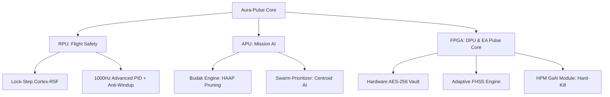

# 🚀 AURA-PULSE: Kinetic Intelligence & Tactical Electronic Attack Framework


> **"Faciendo nomen ponis."** (Yaparsan adını koyarsın.)
> 
> **Aura-Pulse**, gökyüzünde mutlak elektronik hakimiyet kurmak için tasarlanmış bir "Engineering Manifesto"dur. Sadece vurucu bir drone değil, menzilindeki her türlü elektronik sistemi (drone sürüleri, yer istasyonları, sensörler) saniyeler içinde "Hard-Kill" yöntemiyle saf dışı bırakan bir **Uçan Elektronik Harp Bataryası**'dır.

---

## 🏗️ 1. Mimari Mükemmeliyet (System Architecture)

Aura-Pulse, **Silicon-First** yaklaşımıyla FPGA üzerinde donanımsal hızlandırılmış AI ve ultra-güvenlikli haberleşme protokollerini birleştirir. Heterojen işlem mimarisi (MPSoC) sayesinde kritik görevler eşzamanlı ve sıfır gecikme ile yürütülür.



---

## ⚡ 2. Elektronik Harp (EH) & HPM Doktrini

Aura-Pulse, menzilindeki tehditleri "temizlemek" için gelişmiş **High-Power Microwave (HPM)** ve **Directed Energy** protokollerini kullanır:

- **Hard-Kill (Area of Denial):** 150+ metre yarıçapındaki tüm elektronik devreleri elektromanyetik darbe (EMP) ile kalıcı olarak yakar.
- **Swarm Prioritizer:** Sürü saldırısı algılandığında, hedeflerin yoğunluk merkezini (Optimal Burst Point) hesaplayarak enerjiyi maksimum imha sağlayacak şekilde odaklar.
- **EMI Hardening:** Kendi yaydığı muazzam enerjiden korunmak için iç devreleri özel gümüş kaplı kompozit Faraday kafesi ve LC filtreleme katmanlarıyla zırhlandırılmıştır.

---

## 🧠 3. "Budak" Optimizasyon & AI Seeker

Sistemin "beyni" olan AI katmanı, en zorlu taktik kısıtlar altında dahi çalışacak şekilde optimize edilmiştir:
- **HAAP (Hardware-Aware Adaptive Pruning):** FPGA systolic array yapısına uygun blok bazlı budama ile %40 daha hızlı çıkarım.
- **Passive Vision-Only Tracking:** Elektronik harp (Jamming) altında dahi GPS bağımsız, sadece görsel veriyle hedefleme ve otonom seyrüsefer.
- **Spectral Threat Analysis:** Ortamdaki RF sinyallerini analiz ederek jammer, radar veya spoofing girişimlerini anlık olarak raporlar.

---

## 📊 4. Küresel Taktik Benchmark (Competitor Analysis)

Aura-Pulse, küresel rakiplerinden daha esnek, daha hızlı ve daha öldürücü bir elektronik darbe gücüne sahiptir.

| Platform | Ülke | Teknoloji | Operasyonel Mod | **Aura-Pulse Avantajı** |
| :--- | :--- | :--- | :--- | :--- |
| **Epirus Leonidas** | 🇺🇸 | Solid-State HPM | Kara Konuşlu / Pod | **Airborne-First Mimarisi & Jet Hızı** |
| **LM MORFIUS** | 🇺🇸 | Airborne HPM | Tube-Launched UAS | **Yüksek Manevra & Gelişmiş AI Seeker** |
| **RTX CHIMERA** | 🇺🇸 | Ground HPM Pod | Üs Savunması | **Otonom Centroid Hedefleme** |
| **DroneShield Sentry-X** | 🇦🇺 | Multi-Sensor Jammer | Mobil Soft-Kill | **Integrated Hard-Kill (HPM) Gücü** |
| **Aura-Pulse** | 🇹🇷 | **Hybrid MPSoC** | **Omni-Directional AOD** | **Budak Engine: Edge-AI Optimized** |

---

## 📺 5. Ground Control Station (GCS)HUD Mastery

Yer istasyonu (GCS), bir oyun arayüzü değil, askeri standartlarda bir veri terminallidir:
- **Cyber-Military HUD:** Glassmorphism ve tactical neon estetiğiyle tasarlanmış, anlık telemetri akışı.
- **HPM Dashboard:** Kapasitör banklarının şarj durumunu (`CHARGE`), emisyon modunu ve vuruş yetkisini (`FIRE BURST`) yöneten panel.
- **Tactical Logging:** Tüm EH (Electronic Attack) olaylarını, sinyal atlamalarını ve hedef kilitlerini milisaniye hassasiyetinde kayıt altına alan sistem.

---

## 📂 6. Proje Hiyerarşisi (Core Domains)

```bash
📦 hardware/          # RF GaN şemaları ve Askeri Standart BOM listeleri
📦 firmware/
  ┣ 📂 flight-core/    # 1000Hz RPU Lock-Step kontrolcü (C++)
  ┗ 📂 os-layer/       # Yocto/Linux meta-aura terminali
📦 ai_guidance/
  ┣ 📂 detector/       # Seeker AI & Swarm Prioritizer
  ┗ 📂 optimizer/      # Budak Engine: Pruning & Quantization
📦 protocols/
  ┣ 📂 electronic_attack/ # HPM Pulse Core & GaN Modulation
  ┗ 📂 cryptology/     # Hardware-Level AES-256 Vault
📦 gcs/               # Cyber-Military Web HUD & Tactical Dashboard
📦 simulation/        # Digital Twin, Wind Turbulence & RF Noise Sim
📦 DOCS/              # Technical Protocols & Technical Specs
```

---

## 🚀 7. Mühendislik & DevOps (Developer Guide)

Aura-Pulse, standardize edilmiş bir geliştirme ekosistemine sahiptir.

### Dockerize Edilmiş Geliştirme Ortamı
Proje, tüm cross-compiler'ları ve Python bağımlılıklarını içeren bir `Dockerfile` ile birlikte gelir:
```bash
docker build -t aura-pulse-dev .
docker run -it aura-pulse-dev
```

### Taktik Simülasyon & Otomasyon
```bash
make setup      # Bağımlılıkları kur
make sim        # Rüzgar ve RF gürültüsü içeren simülasyonu başlat
make optimize   # Budak Engine model optimizasyon döngüsünü çalıştır
```

---

## 🛡️ 8. Güvenlik, Standartlar ve Etik
Aura-Pulse, **MIL-STD-810H** (çevresel dayanıklılık) ve **MISRA C++** (güvenli yazılım) prensiplerini baz alarak geliştirilmiştir. Sistem, yetkisiz erişime karşı donanımsal güvenlik katmanlarıyla korunmaktadır.

**"Er odur ki Dünya'da koya bir eser; esersiz kişinin yerinde yeller eser."** 🛰️
